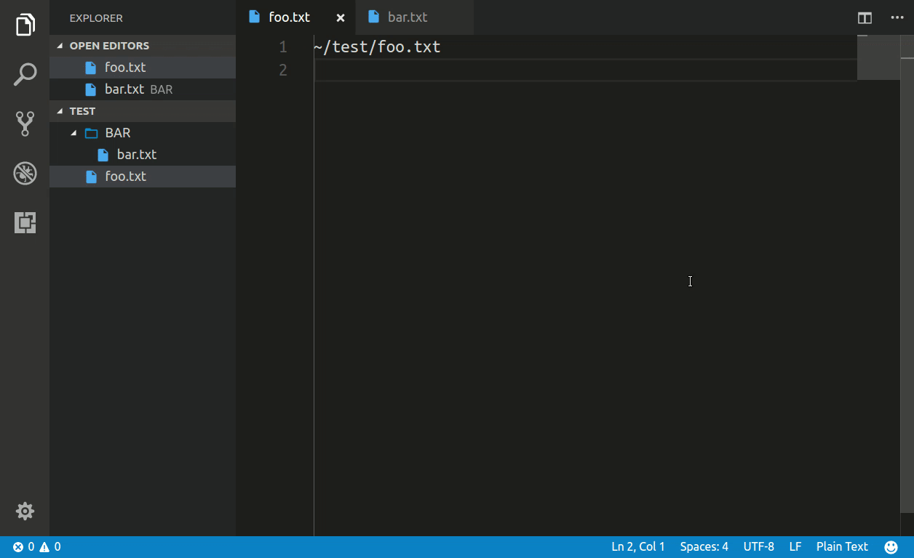

# Integrated Terminal Filedir

This is an extension for vscode to open an integrated terminal at the current file's directory.

## Demo

## Features

- Create (toggle) integrated terminal at the current file's directory
- **Without `cd` command**

## Usage

### Create new terminal
- Put `Create new Integrated Terminal (at the current file's directory)` into command palette.
- Assign your favorite keybind to `workbench.action.terminal.newAtFiledir`. (default: Not assigned)

### Toggle terminal
- Put `Toggle Integrated Terminal (at the current file's directory)` into command palette.
- Assign your favorite keybind to `workbench.action.terminal.toggleTerminalAtFiledir`. (default: Not assigned)

## Notice

This extension change the global configuration `terminal.integrated.cwd` temporarily, but it will be restored after command execution. So you can use this extension without so much worrying about it.

## Release Notes

### 0.0.1

Initial release.

## Auther

[algon-320](https://github.com/algon-320)

## License

This software is released under the MIT License, see LICENSE.txt.
